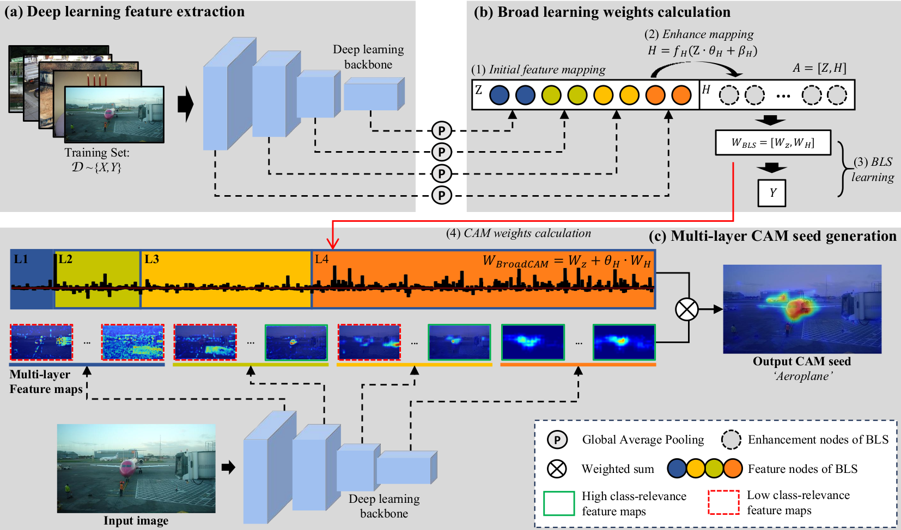

# BroadCAM (Under review)

## Introduction

PyTorch implementation of "BroadCAM: Outcome-agnostic Class Activation Mapping for Small-scale Weakly Supervised Applications".

## Abstract
Class activation mapping~(CAM), a visulization technique for interpreting deep learning models, is now commonly used for weakly supervised semantic segmenration~(WSSS) and object localization~(WSOL). It is the weighted aggregation of the feature maps by activating the high class-relevance ones. Current CAM methods achieve it relying on the training outcomes, such as predicted scores~(forward information), gradients~(backward information), etc. However, when with small-scale data, unstable training may lead to less effective model outcomes and generate unreliable weights, finally resulting in incorrect activation and noisy CAM seeds. In this paper, we propose an outcome-agnostic CAM approach, called BroadCAM, for small-scale weakly supervised applications. Since broad learning system~(BLS) is independent to the model learning, BroadCAM can avoid the weights being affected by the unreliable model outcomes when with small-scale data. By evaluating BroadCAM on VOC2012~(natural images) and BCSS-WSSS~(medical images) for WSSS and OpenImages30k for WSOL, BroadCAM demonstrates superior performance than existing CAM methods with small-scale data~(less than 5%) in different CNN architectures. It also achieves SOTA performance with large-scale training data. Extensive qualitative comparisons are conducted to demonstrate how BroadCAM activates the high class-relevance feature maps and generates reliable CAMs when with small-scale training data.

## Overview


## Requirements
- Python 3.7
- pytorch
- torchvision
- pickle
- sklearn
- CUDA
- 1×GPU

## Usage

1. Download checkpoints of deep models and parameters of BroadCAM from [baidu cloud](https://pan.baidu.com/s/13uqLvMKU_9eyjuj0DENNUg) (``checkpoints.tar``, with code **at4k**)

2. Put the ``checkpoints.tar`` to **./checkpoints** :

```
cp YOUR_CHECKPOINTS_PATH ./checkpoints checkpoints.tar
```
and unzip it by:
```
unzip ./checkpoints/checkpoints.tar
```

3. Generate the CAM seeds for examples by :
```
python demo.py \
--cam_methods [CAM, GradCAM, ScoreCAM, LayerCAM, BroadCAM] \
--proportions [1,2,5,8,10,20,50,80,100]
```
## Citation
If you find the code useful, please consider citing our paper using the following BibTex entry.
```
@article{lin2023broadcam,
  title={BroadCAM: Outcome-agnostic Class Activation Mapping for Small-scale Weakly Supervised Applications},
  author={Lin, Jiatai and Han, Guoqiang and Xu, Xuemiao and Liang, Changhong and Wong, Tien-Tsin and Chen, CL and Liu, Zaiyi and Han, Chu},
  journal={arXiv preprint arXiv:2309.03509},
  year={2023}
}
```

## Reference

Thanks to the implementation of current CAM methods at [TorchCAM](https://github.com/ZhugeKongan/TorchCAM).
